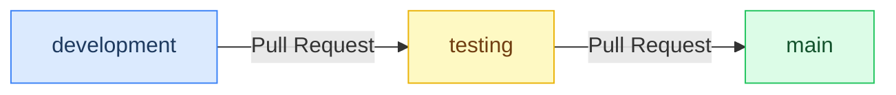

All work flows through three branches in one direction — from active development through validation to production.



| Branch | Purpose | Direct Pushes |
|---|---|---|
| `development` | All active work happens here | ✅ Allowed |
| `testing` | Validation / QA before release | 🔒 Blocked — PR only |
| `main` | Production-ready, stable code | 🔒 Blocked — PR only |

## Day-to-Day Workflow

### Making changes

Always start by switching to `development` and pulling the latest changes before you begin work.

```bash
# Always work on development
git checkout development
git pull origin development

# Make your changes, then commit
git add .
git commit -m "your change description"
git push origin development
```

### Promoting development → testing

1. Go to your repo on GitHub
2. Click **Pull Requests → New pull request**
3. Set **base:** `testing` ← **compare:** `development`
4. Add a description and click **Create pull request**
5. Review and **Merge**

### Promoting testing → main

1. Same steps as above
2. Set **base:** `main` ← **compare:** `testing`
3. Review and **Merge**

## Tips

<div class="note">
  <strong>Never commit directly to <code>main</code> or <code>testing</code></strong> — branch protection rules will block you.
</div>

Keep `development` up to date with `testing` after merges to avoid drift:

```bash
git checkout development
git merge origin/testing
git push origin development
```

Use descriptive PR titles so you have a clear history of what moved to production and when.
