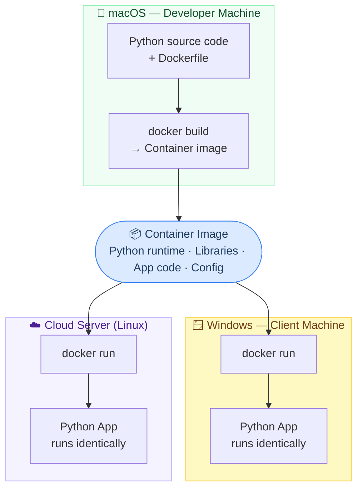

Low-code platforms like OutSystems, Mendix, and Microsoft Power Apps promise rapid application development — and they often deliver. But their licensing costs can run into thousands of dollars per month, putting them firmly out of reach for small businesses operating on tight margins. The good news is that the open-source ecosystem, specifically **Python** and **Docker**, offers a viable path to the same outcomes at a fraction of the cost.

## The Licensing Problem

Low-code platforms are priced for enterprise buyers. Even "entry-level" tiers routinely cost hundreds of dollars per user per month, and the features small businesses actually need — custom integrations, external database connections, deployment to a custom domain — are usually locked behind higher tiers. When you add up annual licensing, per-user seats, and overage fees, the total cost of ownership often exceeds what a small business would spend hiring a developer to build and maintain a custom solution.

| Approach | Typical Annual Cost | Ownership | Customization |
|---|---|---|---|
| Low-code platform (5 users) | $6,000 – $30,000+ | Vendor-owned | Limited to platform capabilities |
| Python + Docker (self-hosted) | $200 – $1,200 (hosting) | You own it completely | Unlimited |

## Why Python

Python has become the most widely used programming language in the world for good reason. It is readable, beginner-friendly compared to most alternatives, and backed by an enormous ecosystem of free libraries. For small business applications specifically, a few libraries do most of the heavy lifting:

- **Flask / FastAPI** — build web applications and internal APIs quickly
- **SQLAlchemy** — connect to any database (PostgreSQL, MySQL, SQLite) without writing raw SQL
- **Pandas** — process, clean, and transform business data
- **Streamlit** — create interactive dashboards and data tools with almost no front-end code
- **Celery** — schedule and automate background tasks (reports, email digests, data syncs)

Combined, these tools can replace the core functionality of most low-code platforms: data entry forms, automated workflows, reports, dashboards, and integrations with third-party services.

## Why Docker

The classic small-business software nightmare is "it works on my machine." An application built by a contractor or a part-time developer stops working the moment the server gets updated, a dependency changes, or someone new takes over IT. Docker solves this by packaging the application and everything it needs to run — the Python version, every library, every configuration file — into a single portable container.

Key advantages for small business deployments:

- **Consistent environments** — the app runs identically on a developer's laptop, a test server, and production
- **Easy deployment** — moving the app to a new server is a single command, not a multi-day migration project
- **Isolation** — multiple applications can run on the same cheap server without interfering with each other
- **Simple backups** — container definitions are text files that live in version control, so the entire application is recoverable
- **No vendor lock-in** — Docker containers run on any cloud provider or on-premise server

## A Real-World Example: KCI_Pinacle

This article isn't purely theoretical — it grew directly out of a project I built called **KCI_Pinacle**. A friend who runs a small business came to me with a problem: his accounting software needed to exchange data with his bank's **Positive Pay** interface, a fraud-prevention system that guards against check washing. The bank's system expected a specific file format that his accounting application couldn't produce on its own, and there was no off-the-shelf tool that bridged the two.

A low-code platform wasn't a realistic option — the licensing cost alone would have exceeded the value of the time saved. Instead, I built a Python application to handle the translation: reading the accounting export, reformatting the data to the bank's exact specification, and producing a file ready for upload.

There was an added wrinkle: I develop on a Mac, and my friend's shop runs entirely on Windows. Docker made this a non-issue. The application runs in a container that behaves identically on both platforms — I build and test it on macOS, and he runs it on Windows without any changes. That cross-platform consistency would have been a significant engineering challenge without containerization.

  The total cost of this solution was development time. There are no licensing fees, no per-user seats, and no vendor to call if the integration breaks. My friend owns it outright.

## What It Takes to Get Started

  You don't need a full-time developer on staff. Many small businesses commission a Python/Docker application once, then maintain it themselves or with occasional contractor help — at a cost far below ongoing platform licensing.

The realistic requirements to adopt this approach are:

- A one-time investment in development (build it right once)
- A basic cloud hosting account (AWS, DigitalOcean, Linode, or similar)
- Someone comfortable running occasional terminal commands for updates
- Version control (GitHub) so the codebase is never locked on one person's computer

## The Bottom Line

Low-code platforms make sense when speed of delivery outweighs all other concerns and budget is not a constraint. For small businesses, the calculus is usually the opposite. Python and Docker together provide a stable, affordable, and fully owned foundation for custom business applications — without recurring license fees, vendor dependency, or platform limitations that force expensive workarounds down the road.

The open-source ecosystem has matured to the point where the gap in development speed between low-code platforms and Python is smaller than it has ever been. For a small business willing to invest once in the right foundation, the long-term savings are substantial.
